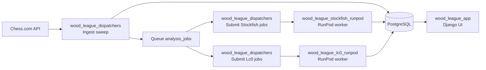

# Wood League Chess

Wood League Chess is a private chess club analytics platform built with Django, Tailwind CSS v4, and HTMX. It ingests games from Chess.com, runs them through Stockfish and Lc0 engine workers, and surfaces club-wide trends, per-game analysis, opening statistics, and AI-powered game search.

This repository, `wood_league_app`, is the user-facing Django web app. It serves club history, game analysis, opening pages, search, and admin views from data produced by the ingest and engine-analysis pipeline.

## Repos at a Glance

| Repo | Purpose |
|---|---|
| [`wood_league_app`](.) | Django web app (this repo) — views, templates, models, ingest management commands |
| [`wood_league_dispatchers`](https://github.com/christophersw/wood_league_dispatchers) | Railway dispatcher for Chess.com ingest and RunPod job submission |
| [`wood_league_stockfish_runpod`](https://github.com/christophersw/wood_league_stockfish_runpod) | RunPod Stockfish worker that writes `game_analysis` and `move_analysis` |
| [`wood_league_lc0_runpod`](https://github.com/christophersw/wood_league_lc0_runpod) | RunPod Lc0 worker that writes `lc0_game_analysis` and `lc0_move_analysis` |

## System Flow



## Django App Structure

| App | Purpose |
|---|---|
| `accounts` | Custom email-based `User` model, login/logout views, `LoginRequiredMiddleware` |
| `dashboard` | Club dashboard: recent games, accuracy trends, opening flow |
| `games` | Game list and detail views, board builder, stat cards |
| `analysis` | Engine analysis job queue, Stockfish/Lc0 status views |
| `openings` | Opening repertoire explorer with continuation trees and W/D/L stats |
| `players` | Player roster and admin member management |
| `search` | AI-assisted and keyword game search with HTMX partials |
| `ingest` | Django management commands wrapping Chess.com sync and analysis workers |

## What the App Shows

- **Dashboard** (`/`): recent games, club accuracy trends, opening flow, best games, and ingest freshness
- **Games** (`/games/`): browseable game list with animated board previews; detail view at `/games/<slug>/`
- **Game Analysis** (`/games/<slug>/`): move-by-move Stockfish or Lc0 review with board, arrows, and metrics
- **Opening Explorer** (`/openings/<id>/`): opening-level performance, continuation flow, and filtered game lists
- **Game Search** (`/search/`): keyword and AI-assisted (Claude) natural-language search
- **Admin** (`/admin/`): analysis queue visibility and club roster management

## Related Docs

- [Database ERD](docs/database-erd.md)
- [ERD source](docs/erd.mmd)
- [Dispatcher README](../wood_league_dispatchers/README.md)
- [Stockfish RunPod README](../wood_league_stockfish_runpod/README.md)
- [Lc0 RunPod README](../wood_league_lc0_runpod/README.md)

---

## Setup

```bash
# Create and activate a virtual environment
python3.13 -m venv .venv
source .venv/bin/activate   # Windows: .venv\Scripts\activate

# Install dependencies
pip install -r requirements.txt

# Apply database migrations
python manage.py migrate
```

### Environment variables

Create a `.env` file in `wood_league_app/` (or set these in your shell / Railway dashboard):

| Variable | Required | Default | Description |
|---|---|---|---|
| `SECRET_KEY` | Yes (prod) | insecure dev key | Django secret key — use a long random string in production |
| `DEBUG` | No | `True` | Set to `False` in production |
| `ALLOWED_HOSTS` | No | `localhost,127.0.0.1` | Comma-separated allowed hostnames |
| `DATABASE_URL` | No | local SQLite | PostgreSQL connection string (`postgresql://...`) |
| `CHESS_COM_USERNAMES` | Yes (for sync) | — | Comma-separated Chess.com usernames to track |
| `CHESS_COM_USER_AGENT` | No | built-in | Custom User-Agent string for Chess.com API requests |
| `INGEST_MONTH_LIMIT` | No | `0` | Limit sync to last N months; `0` means full history |
| `ANTHROPIC_API_KEY` | No | — | Enables AI-powered natural-language game search |
| `ANTHROPIC_MODEL` | No | `claude-3-haiku-20240307` | Claude model for AI search |
| `STOCKFISH_PATH` | No | auto-detected | Full path to Stockfish binary; auto-detected from `PATH` if omitted |
| `ANALYSIS_DEPTH` | No | `20` | Stockfish search depth per position |
| `ANALYSIS_THREADS` | No | `1` | CPU threads Stockfish uses per game |
| `LC0_PATH` | No | — | Full path to the `lc0` binary; required to run Lc0 WDL analysis |
| `LC0_NODES` | No | `800` | MCTS node budget per position for Lc0 (higher = stronger, slower) |
| `LC0_NETWORK` | No | — | Optional: path to a specific Lc0 network weights file |

### Run the app

```bash
python manage.py runserver
```

The app is served at `http://localhost:8000`. Authentication is enabled by default — create a superuser first:

```bash
python manage.py createsuperuser
```

## Local Development Modes

- **App only**: run against an already-populated database — `python manage.py runserver`
- **App + ingest**: run `python manage.py sync_games` to pull fresh games from Chess.com
- **App + local engine workers**: use the local Stockfish / Lc0 management commands below
- **Full deployed flow**: use [`wood_league_dispatchers`](../wood_league_dispatchers/README.md) with the two RunPod worker repos

---

## Ingest: Syncing games from Chess.com

```bash
python manage.py sync_games
```

Fetches all archives for the configured usernames and upserts games into the database. Safe to re-run — already-stored games are updated, not duplicated.

**Options:**

| Flag | Description |
|---|---|
| `--usernames alice,bob` | Override `CHESS_COM_USERNAMES`; comma-separated |

**Examples:**

```bash
# Sync usernames from .env
python manage.py sync_games

# Sync specific usernames without changing .env
python manage.py sync_games --usernames christophersw,opponent1
```

**When to run:**
- After first setup to populate the database
- On a schedule (e.g. nightly cron) to pick up new games
- Manually after a tournament or active play session

---

## Stockfish analysis

Analysis is a two-step process: first **enqueue** the games you want analyzed, then **run a worker** to process them. The two steps can be combined into one command.

### Step 1 — Enqueue unanalyzed games

```bash
python manage.py run_analysis_worker --enqueue-only
```

Scans the database for games with PGN that have not yet been analyzed and creates a job queue entry for each one. Safe to re-run — already-queued or completed games are skipped.

**Options:**

| Flag | Description |
|---|---|
| `--enqueue-limit N` | Only enqueue up to N games (useful for a trial run) |
| `--depth N` | Stockfish search depth to request (default `20`); stored on the job |

### Step 2 — Run the worker

```bash
python manage.py run_analysis_worker --no-poll
```

Claims jobs from the queue one at a time, runs Stockfish on each game's PGN, and saves per-move centipawn evals, best-move arrows, accuracy scores, and blunder/mistake/inaccuracy counts to the database.

**Options:**

| Flag | Description |
|---|---|
| `--stockfish /path/to/sf` | Path to Stockfish binary; auto-detected from `PATH` if omitted |
| `--depth N` | Analysis depth per position (default `20`; higher = slower but more accurate) |
| `--threads N` | CPU threads Stockfish uses internally per game (default `1`) |
| `--limit N` | Stop after processing N games and exit |
| `--no-poll` | Exit when the queue is empty instead of waiting for new jobs |
| `--poll-interval N` | Seconds to wait between queue checks when polling (default `5`) |
| `--status` | Print job counts by status and exit |

### Combined: enqueue + analyze in one command

```bash
python manage.py run_analysis_worker --enqueue --no-poll
```

### Check queue status

```bash
python manage.py run_analysis_worker --status
```

Output example:
```
  completed     1450
  pending       7127
  failed           3
```

### Run multiple workers in parallel

Each worker safely claims its own jobs via `SELECT FOR UPDATE SKIP LOCKED` (PostgreSQL) so there are no duplicate analyses. On a machine with 8 cores:

```bash
for i in 1 2 3 4; do
  python manage.py run_analysis_worker --threads 2 --no-poll &
done
wait
```

### Worker crash recovery

If a worker is killed mid-job, its jobs are left in `running` state. On the next startup the worker automatically resets any jobs that have been `running` for more than 10 minutes back to `pending` so they will be retried.

### Depth guidance

| Depth | Speed | Use case |
|---|---|---|
| `12–15` | Fast (~1–2s/move) | Quick bulk pass across thousands of games |
| `18–20` | Medium (~3–6s/move) | Default; good balance of accuracy and speed |
| `22+` | Slow (10s+/move) | Deep review of specific important games |

---

## Lc0 (Leela Chess Zero) WDL Analysis

Leela Chess Zero is a neural-network chess engine that, unlike Stockfish, outputs **native Win/Draw/Loss probabilities** directly from its value head. This means draw probability is a first-class signal — something Stockfish cannot produce without post-processing. The Lc0 analysis pipeline runs alongside the Stockfish pipeline; both share the same job queue and database, and both can be run independently.

### What Lc0 produces

Lc0 is invoked via the UCI protocol with `UCI_ShowWDL=true`. After each position evaluation it appends a WDL triple to the `info` line:

```
info depth 10 seldepth 15 time 380 nodes 800 score cp 23 wdl 412 347 241 ...
```

The three values are **permille** (thousandths), always summing to 1000:

| Value | Meaning | Example above |
|---|---|---|
| `wdl_win` | Win probability for the side to move | 41.2% |
| `wdl_draw` | Draw probability | 34.7% |
| `wdl_loss` | Loss probability for the side to move | 24.1% |

All WDL values are stored from **White's perspective** in the database. A position where White has 60% win chance, 30% draw, and 10% loss probability is stored as `wdl_win=600, wdl_draw=300, wdl_loss=100`.

### Node budget vs. depth

Lc0 does not use fixed-depth alpha-beta search. Instead, it runs **Monte Carlo Tree Search (MCTS)** up to a configurable node budget (`LC0_NODES`). More nodes = stronger play, but analysis time scales roughly linearly with node count.

| Nodes | Approximate time/position | Use case |
|---|---|---|
| 200–400 | ~0.1–0.3s | Quick bulk pass, weaker analysis |
| 800 | ~0.5–1s | Default; good balance |
| 2000–5000 | ~2–5s | Deep review of critical games |
| 10000+ | 10s+ | Near-engine-strength analysis |

Hardware matters significantly: Lc0 benefits from GPU acceleration (Metal on Apple Silicon/Intel Mac, CUDA on NVIDIA, OpenCL on AMD). On CPU-only it is considerably slower than Stockfish at equivalent quality.

### Running Lc0 analysis

Analysis is the same two-step process as Stockfish: enqueue jobs, then run the worker.

#### Step 1 — Enqueue

```bash
python manage.py run_lc0_worker --enqueue --lc0-path /path/to/lc0
```

This scans the database for all games that do not yet have an `engine='lc0'` job and creates one for each. Safe to re-run — already-queued games are skipped.

#### Step 2 — Run the worker

```bash
python manage.py run_lc0_worker --lc0-path /path/to/lc0
```

Or combine both steps:

```bash
python manage.py run_lc0_worker --enqueue --lc0-path /path/to/lc0 --nodes 800
```

**Options:**

| Flag | Description |
|---|---|
| `--lc0-path /path/to/lc0` | Path to the `lc0` binary (or set `LC0_PATH` in `.env`) |
| `--nodes N` | MCTS node budget per position (default `800`; or set `LC0_NODES`) |
| `--enqueue` | Enqueue all un-analyzed games before starting the worker |
| `--limit N` | Stop after processing N games |
| `--poll-interval N` | Seconds between queue checks (default `5`; use `0` to exit when empty) |

#### Finding your Lc0 binary

```bash
# macOS via Homebrew
brew install lc0

# Check where it is
which lc0
```

The default network weights bundled with Lc0 (typically `maia` or `BT4`) work well. You can download stronger networks from [lczero.org/networks](https://lczero.org/networks/) and point to them via `LC0_NETWORK`.

---

## How Analysis Calculations Work

This section documents every formula used to evaluate moves and compute player accuracy scores.

### Stockfish engine evaluation

Each position is evaluated by [Stockfish](https://stockfishchess.org/) (via [python-chess](https://python-chess.readthedocs.io/)) at a configurable search depth (default 20). The engine is called with `multipv=2` so the top two candidate moves are returned — this is required for brilliant and great move detection. The engine returns scores in **centipawns** (cp) — hundredths of a pawn — from White's perspective. Positive values favour White; negative values favour Black.

**Mate scores** are encoded by `python-chess` using `score(mate_score=10000)`. A forced mate in 5 for White becomes `+10000 − 5 = +9995` cp; a forced mate in 3 against White becomes `−10000 + 3 = −9997` cp. This preserves the distance-to-mate while keeping all evaluations on a single numeric axis.

### Per-move analysis loop (Stockfish)

For every move in the game, the engine evaluates the position **before** the move is played and **after**. This yields two data points per move:

1. **Centipawn loss (CPL)** — how many centipawns the mover lost compared to the best available move:

$$
\text{CPL} = \max\!\big(0,\;\text{eval}_{\text{before}} - \text{eval}_{\text{after}}\big)
$$

where both evals are from the mover's perspective (White-relative for White's moves, inverted for Black's moves). CPL is always ≥ 0 because a move cannot improve on the engine's best evaluation of the position before it was played.

2. **Win Percentage (Win%)** — converts the raw centipawn eval into a human-readable winning-chance percentage on a 0–100 scale.

### Win Percentage formula

We use the empirical sigmoid function from [Lichess](https://lichess.org/page/accuracy), calibrated against real game outcomes among 2300+ rated players ([source](https://github.com/lichess-org/lila/pull/11148)):

$$
\text{Win\%} = 50 + 50 \times \left(\frac{2}{1 + e^{-0.00368208 \times \text{cp}}} - 1\right)
$$

where `cp` is the centipawn evaluation **from the mover's perspective** (positive = favourable).

| Centipawns | Win% |
|---|---|
| 0 (equal) | 50.0% |
| +100 (~1 pawn advantage) | 59.1% |
| +300 (~3 pawns) | 75.1% |
| −300 | 24.9% |
| +10000 (forced mate) | ≈100.0% |

**Source:** [lichess-org/scalachess — `WinPercent.winningChances`](https://github.com/lichess-org/scalachess/blob/master/core/src/main/scala/eval.scala)

### Per-move Accuracy

Each move receives an accuracy score (0–100%) based on how much Win% the mover lost. The formula is applied to the Win% **before** and **after** the move, both from the mover's perspective:

$$
\text{Accuracy\%} = 103.1668100711649 \times e^{-0.04354415386753951 \times (\text{Win\%}_{\text{before}} - \text{Win\%}_{\text{after}})} - 3.166924740191411 + 1
$$

The result is clamped to [0, 100]. If the mover's Win% did not decrease (i.e. the engine considers the position no worse), accuracy is 100%.

The `+1` term is an **uncertainty bonus** that accounts for imperfect analysis depth — at finite depth, the engine may not have found the absolute best move, so a small benefit of the doubt is given. This matches the Lichess implementation exactly.

The formula coefficients were derived via `scipy.optimize.curve_fit` against a hand-crafted accuracy curve:

| Win% loss | Expected Accuracy |
|---|---|
| 0 | 100% |
| 5 | ~75% |
| 10 | ~60% |
| 20 | ~42% |
| 40 | ~20% |
| 60 | ~5% |
| 80+ | ~0% |

**Source:** [lichess-org/lila — `AccuracyPercent.scala`](https://github.com/lichess-org/lila/blob/master/modules/analyse/src/main/AccuracyPercent.scala)

### Game Accuracy (aggregation)

Individual move accuracies are aggregated into a single game accuracy score per player using the same two-tier formula as Lichess: a blend of **volatility-weighted arithmetic mean** and **harmonic mean**:

$$
\text{Game Accuracy} = \frac{\text{WeightedMean} + \text{HarmonicMean}}{2}
$$

**Volatility weighting** assigns each move a weight equal to the standard deviation of Win% within a sliding window of recent positions (window size = `max(2, min(8, moves ÷ 10))`), clamped to [0.5, 12]. Moves played in volatile, sharp positions — where the win chance is swinging — receive higher weight.

**Harmonic mean** penalises bad moves more heavily than an arithmetic mean:

$$
\text{HarmonicMean} = \frac{n}{\displaystyle\sum_{i=1}^{n} \frac{1}{\max(\text{MoveAcc}_i,\;\varepsilon)}}
$$

where $\varepsilon = 0.001$ prevents division by zero.

This combination means:
- Mistakes in critical, volatile positions matter more than the same CPL in a quiet, already-decided position.
- A single blunder cannot be masked by many subsequent good moves (harmonic mean property).

**Source:** [lichess-org/lila — `AccuracyPercent.scala`](https://github.com/lichess-org/lila/blob/master/modules/analyse/src/main/AccuracyPercent.scala)

### Average Centipawn Loss (ACPL)

ACPL is the arithmetic mean of the per-move CPL values for one side:

$$
\text{ACPL} = \frac{1}{n}\sum_{i=1}^{n} \text{CPL}_i
$$

This is the traditional metric for measuring playing strength. Lower is better; grandmasters typically average 10–25 ACPL.

### Move classification

Moves are classified using a combination of centipawn loss, material sacrifice detection, and the gap to the second-best engine move:

| Classification | Symbol | Criteria |
|---|---|---|
| Brilliant | !! | CPL < 10, is a capture (material sacrifice), position not already clearly winning (Win% < 70%), and all alternatives are ≥ 150 cp worse |
| Great | ! | CPL < 10, and all alternatives are ≥ 80 cp worse (only good move) |
| Best | — | CPL < 10, neither brilliant nor great |
| Excellent | — | CPL 10–49 |
| Inaccuracy | ?! | CPL 50–99 |
| Mistake | ? | CPL 100–299 |
| Blunder | ?? | CPL ≥ 300 |

**Brilliant moves** require a capture because a sacrifice that turns out to be best is the hallmark of a truly unexpected move. The position must not already be clearly winning (Win% < 70%) to prevent trivial mopping-up moves from earning `!!`. This mirrors the spirit of Chess.com's brilliant move detection.

**Great moves** capture the "only good move" scenario — the player found the right path when all alternatives were significantly worse, regardless of whether material was sacrificed.

> **Note on Chess.com vs Lichess:** Chess.com uses an **Expected Points** model with rating-adjusted thresholds rather than fixed CPL cutoffs. Lichess does not perform automated brilliant/great move detection (annotations are manual only). Our classification uses fixed CPL thresholds (matching Lichess) combined with a Chess.com-inspired heuristic for brilliant/great detection.

### Persisted data (Stockfish)

After Stockfish analysis, the following are stored per game:

| Table | Key fields |
|---|---|
| `game_analysis` | `white_accuracy`, `black_accuracy`, `white_acpl`, `black_acpl`, `white_blunders`, `white_mistakes`, `white_inaccuracies` (same for black), `engine_depth`, `analyzed_at` |
| `move_analysis` | `ply`, `san`, `fen`, `cp_eval` (white-relative), `best_move` (UCI), `cpl`, `classification` |
| `game_participants` | `quality_score` (= accuracy), `acpl`, `blunder_count`, `mistake_count`, `inaccuracy_count` |

When stored Stockfish accuracy is unavailable (e.g. for games not yet fully analyzed), the Game Analysis page falls back to a **derived accuracy** computed from the stored per-move CPL values using the same Win% → per-move accuracy → harmonic mean pipeline described above.

---

## Lc0 Analysis Calculations

This section documents the formulas used by the Lc0 WDL analysis pipeline (`app/services/lc0_service.py`).

### WDL output and perspective

Lc0 outputs WDL from the **side-to-move's perspective**. `python-chess` returns this as an `engine.Wdl` object with `.wins`, `.draws`, `.losses` relative to the side to move. The service converts all values to **White's perspective** before storage:

- When White is to move: WDL is already White-perspective — store as-is.
- When Black is to move: flip wins and losses (`stored_win = engine_loss`, `stored_loss = engine_win`), draw is unchanged.

This means `lc0_move_analysis.wdl_win` always represents White's win probability at that position, regardless of whose turn it was.

### Q value and centipawn equivalent

In addition to WDL, Lc0 produces a **Q value** in the range [−1, 1] — the mean expected outcome across all MCTS playouts, where +1 = certain White win, −1 = certain White loss. Q is converted to an approximate centipawn equivalent for display and for use in the fallback eval chart when Lc0 is the only engine available:

$$
\text{cp}_{\text{equiv}} = 111.71 \times \tan(1.56 \times Q)
$$

This formula is the inverse of the standard logistic mapping used by many engines. Q is clamped to ±0.9999 before conversion to avoid the singularity at Q = ±1. At Q = 0 the result is 0 cp (equal); at Q ≈ 0.9 it yields roughly +800 cp (clearly winning).

| Q value | cp equivalent | Meaning |
|---|---|---|
| 0.0 | 0 | Equal position |
| ±0.1 | ≈ ±11 | Slight advantage |
| ±0.3 | ≈ +35 | Clear advantage |
| ±0.6 | ≈ +80 | Large advantage |
| ±0.9 | ≈ +800 | Near-decisive |
| ±0.9999 | capped | Forced win/loss |

**Source:** [Lc0 documentation — Q to centipawn conversion](https://lczero.org/blog/)

### Move quality: Win% delta

Rather than centipawn loss, Lc0 move quality is measured in **win-percentage loss** from the mover's perspective:

$$
\Delta\text{Win\%} = \max\!\big(0,\;\text{Win\%}_{\text{mover,before}} - \text{Win\%}_{\text{mover,after}}\big)
$$

- **Before the move:** the engine is queried on the position and returns WDL relative to the side to move. The mover's win% = `wdl_win / 10.0` (converting permille to percent).
- **After the move:** the board is advanced, the engine is queried again, and it returns WDL relative to the new side to move (the opponent). The mover's resulting win% = `opponent_wdl_loss / 10.0` (i.e. the opponent's loss is the mover's win from the opponent's WDL output).

This two-query approach is identical in structure to the Stockfish before/after loop, except the currency is win probability instead of centipawns.

### Lc0 move classification

Thresholds are in win-percentage-loss units, calibrated to produce roughly equivalent classification rates to the Stockfish CPL thresholds:

| Classification | Symbol | Win% loss criterion |
|---|---|---|
| Brilliant | !! | Δ ≤ 1%, is a capture, mover's win% before < 70%, and best alternative Δ ≥ 10% worse |
| Great | ! | Δ ≤ 1%, and best alternative Δ ≥ 6% worse |
| Best | — | Δ ≤ 1%, neither brilliant nor great |
| Excellent | — | 1% < Δ < 2% |
| Inaccuracy | ?! | 2% ≤ Δ < 5% |
| Mistake | ? | 5% ≤ Δ < 10% |
| Blunder | ?? | Δ ≥ 10% |

The alternative move's quality is measured using `multipv=2`: the engine returns both the best move and the second-best move, and their win% difference determines whether the position was an "only good move" situation.

### Why draw probability matters

Stockfish's centipawn score compresses all outcomes onto a single axis and cannot distinguish between:

- A genuinely drawn position (`wdl 50 900 50` — both sides have minimal winning chances)
- A sharp, double-edged position (`wdl 450 100 450` — either side could win)

Both positions might evaluate near 0 cp, but they call for completely different play. Lc0's explicit draw probability exposes this distinction. The stacked area WDL chart in the Game Analysis page shows all three probabilities simultaneously, giving a richer picture of how the game evolved.

### Persisted data (Lc0)

After Lc0 analysis, the following are stored per game in dedicated tables (Stockfish tables are not modified):

| Table | Key fields |
|---|---|
| `lc0_game_analysis` | `white_win_prob`, `white_draw_prob`, `white_loss_prob` (same for black), `white_blunders`, `white_mistakes`, `white_inaccuracies` (same for black), `engine_nodes`, `network_name`, `analyzed_at` |
| `lc0_move_analysis` | `ply`, `san`, `fen`, `wdl_win`, `wdl_draw`, `wdl_loss` (white-perspective permille), `cp_equiv`, `best_move` (UCI), `arrow_uci`, `move_win_delta`, `classification` |

The `analysis_jobs` table uses an `engine` column (`'stockfish'` or `'lc0'`) to route jobs to the correct worker. Both workers claim jobs independently using `SELECT FOR UPDATE SKIP LOCKED`.

---

## Routing

| Page | URL |
|---|---|
| Dashboard | `/` |
| Game list | `/games/` |
| Game detail + analysis | `/games/<slug>/` |
| Game search | `/search/` |
| Opening explorer | `/openings/<id>/` |
| Analysis status (admin) | `/admin/analysis-status/` |
| Club members (admin) | `/admin/members/` |
| Login / Logout | `/auth/login/`, `/auth/logout/` |
| Django admin | `/django-admin/` |

HTMX partials are served under `/_partials/` and are not intended to be navigated to directly.

---

## Authentication

Authentication is always on. All routes except `/auth/login/` and `/auth/logout/` require a logged-in session, enforced by `LoginRequiredMiddleware`.

Create the first admin account with:

```bash
python manage.py createsuperuser
```

Django's session-based auth persists across tabs and browser restarts. The custom `LegacyPbkdf2Hasher` backend transparently migrates passwords stored in the old Streamlit format to Django's native PBKDF2 format on first login.

---

## Security Scanning

This project uses [Snyk](https://snyk.io) for dependency vulnerability scanning and static code analysis. Install the CLI once via Homebrew:

```bash
brew tap snyk/tap && brew install snyk-cli
snyk auth   # opens browser to authenticate
```

### Workflow summary

| When | Tool | Scope | Speed |
|---|---|---|---|
| After each file edit (agent) | `bandit -ll <file>` | Edited file only | ~instant |
| Before every commit (git hook) | `snyk code test` | Whole repo | ~30–60s |
| On demand / CI | `./security-scan.sh` | All four repos | ~5 min |

### Pre-commit hook setup

Run once after cloning to install the `snyk code test` hook in all four repos:

```bash
./install-hooks.sh
```

The hook blocks commits if any Medium or High code issues are found. To bypass for a single commit:

```bash
git commit --no-verify
```

### Agent instructions (`CLAUDE.md`)

The `CLAUDE.md` in this repo root instructs AI agents (Claude Code, Zed, etc.) to run `bandit -ll <file>` after editing any `.py` file, and to fix any Medium/High findings before handing back. Install `bandit` once:

```bash
pip3 install bandit
```

### Running all scans manually

`security-scan.sh` runs dep, code, and container scans across all four repos:

```bash
./security-scan.sh          # standard (skips slow CUDA container pull)
./security-scan.sh --full   # includes nvidia/cuda container scan
```

The individual scan commands are documented below for reference.

### Dependency scan (open-source vulnerabilities)

Snyk's pip scanner requires a virtual environment with the dependencies installed. Run from each repo root:

```bash
# wood_league_app (requirements.txt)
python3 -m venv .snyk-venv && .snyk-venv/bin/pip install -r requirements.txt
snyk test --file=requirements.txt --package-manager=pip --command=.snyk-venv/bin/python

# wood_league_stockfish_runpod (requirements.txt)
python3 -m venv .snyk-venv && .snyk-venv/bin/pip install -r requirements.txt
snyk test --file=requirements.txt --package-manager=pip --command=.snyk-venv/bin/python

# wood_league_dispatchers and wood_league_lc0_runpod (pyproject.toml — use pip freeze workaround)
python3 -m venv .snyk-venv && .snyk-venv/bin/pip install -e . && .snyk-venv/bin/pip freeze > .snyk-requirements.txt
snyk test --file=.snyk-requirements.txt --package-manager=pip --command=.snyk-venv/bin/python
```

### Static code analysis

Run from each repo root — no venv needed:

```bash
snyk code test
```

### Container scan (base image OS CVEs)

Scans OS packages in the Docker base image without needing to build it locally. Run from each repo that has a Dockerfile:

```bash
# Stockfish and Dispatchers (python:3.11-slim base)
snyk container test python:3.11-slim --file=Dockerfile

# Lc0 (CUDA base — slow, pulls a large image)
snyk container test nvidia/cuda:12.8.1-cudnn-runtime-ubuntu24.04 --file=Dockerfile
```

All findings from the `python:3.11-slim` base are **Low severity** OS-level CVEs (glibc, systemd, ncurses, etc.) with no fix available short of a base image rebuild. These are ambient Debian issues, not application vulnerabilities. Re-run periodically to catch if anything escalates to Medium/High.

> **Note:** `snyk iac test` does not apply here — it supports Terraform/Helm/Kubernetes YAML only, not Dockerfiles or TOML configs.

### Known findings (as of last scan)

| Repo | Type | Severity | Location | Notes |
|---|---|---|---|---|
| `wood_league_app` | Code | Low | `app/ingest/sync_service.py:196` | `hashlib.sha1` — weak hash (non-security use: game deduplication) |
| `wood_league_stockfish_runpod` | Code | Low | `stockfish_pipeline/ingest/sync_service.py:191` | `hashlib.sha1` — weak hash |
| `wood_league_dispatchers` | Code | Low | `dispatchers/ingest/sync_service.py:190` | `hashlib.sha1` — weak hash |
| `wood_league_lc0_runpod` | Code | — | — | ✅ Clean |

All four repos have **no dependency vulnerabilities**.

---

## Deploy to Railway

1. Push this repo to GitHub.
2. In Railway, create a new project → **Deploy from GitHub repo**.
3. Attach a **PostgreSQL** plugin and Railway will inject `DATABASE_URL` automatically.
4. Add environment variables in the Railway dashboard (see table above). At minimum set `SECRET_KEY`, `DEBUG=False`, and `ALLOWED_HOSTS`.
5. Deploy. Railway uses `railway.toml` (Nixpacks builder) which:
   - Installs `stockfish` via Nix (available on PATH automatically)
   - Runs `pip install -r requirements.txt`
   - Runs `python manage.py migrate`
   - Starts Gunicorn on `0.0.0.0:$PORT`

**Notes:**
- Do not set `PORT` manually — Railway injects it automatically.
- Always set a strong `SECRET_KEY` in production.
- Run the sync command against your Railway database from your local machine by setting `DATABASE_URL` in your shell before running `manage.py sync_games`.

---

## Analysis Worker API

The Analysis Worker API enables remote workers (Stockfish/Lc0 engines on RunPod or other cloud platforms) to:
- **Checkout** analysis jobs from the queue
- **Report results** (moves, evaluations, WDL probabilities, metrics)
- **Report errors** (with retry auto-recovery)
- **Send heartbeats** (status updates, engine info)
- **Check queue status** (health, pending job count)

### Authentication

All API endpoints except `/health/` require an **API key** in the `X-Api-Key` header. Keys are issued via the Django admin UI at `/admin/api-keys/`.

```bash
curl -H "X-Api-Key: <raw-key-from-admin-ui>" https://app.example.com/api/v1/jobs/status/
```

### Endpoints

| Method | Path | Auth | Purpose |
|--------|------|------|---------|
| `GET` | `/api/v1/health/` | None | Liveness check; returns `{"status": "ok"}` |
| `GET` | `/api/v1/jobs/status/` | Key | Queue health; returns `{"pending": N, "running": N, "completed": N}` |
| `POST` | `/api/v1/jobs/checkout/` | Key | Claim next pending job; returns job ID + board FEN |
| `POST` | `/api/v1/jobs/<id>/complete/stockfish/` | Key | Submit Stockfish analysis results; updates job as `completed` |
| `POST` | `/api/v1/jobs/<id>/complete/lc0/` | Key | Submit Lc0 analysis results (WDL); updates job as `completed` |
| `POST` | `/api/v1/jobs/<id>/fail/` | Key | Report job failure; retries up to `MAX_JOB_RETRIES` times, then marks `failed` |
| `POST` | `/api/v1/jobs/<id>/heartbeat/` | Key | Send worker status update; updates `last_heartbeat_at` timestamp |

### Example: Checkout Job

**Request:**
```bash
POST /api/v1/jobs/checkout/
X-Api-Key: sk-abc123...
Content-Type: application/json

{
  "worker_id": "stockfish-runpod-001",
  "engine": "stockfish",
  "available_depth": 22
}
```

**Response (200):**
```json
{
  "id": "job-12345",
  "board_fen": "rnbqkbnr/pppppppp/8/8/8/8/PPPPPPPP/RNBQKBNR w KQkq - 0 1",
  "moves_pgn": "1. e4 c5",
  "requested_depth": 20,
  "game_id": "game-5678"
}
```

**Response (204 No Content):**
No jobs available in queue.

### Example: Submit Stockfish Results

**Request:**
```bash
POST /api/v1/jobs/job-12345/complete/stockfish/
X-Api-Key: sk-abc123...
Content-Type: application/json

{
  "worker_id": "stockfish-runpod-001",
  "engine_depth": 22,
  "nodes": 1500000,
  "analysis": [
    {"ply": 0, "eval": 50, "best_move": "e2e4", "mate_in": null},
    {"ply": 1, "eval": 40, "best_move": "c7c5", "mate_in": null},
  ]
}
```

**Response (200):**
```json
{
  "id": "job-12345",
  "status": "completed",
  "completed_at": "2025-05-06T14:32:18Z"
}
```

### Fault Tolerance & Recovery

**Stale Job Recovery:** If a worker crashes mid-analysis, jobs stuck in `running` state for more than `STALE_JOB_TIMEOUT_MINUTES` (default 15) are automatically reset to `pending` on the next `/checkout/` call. Workers need not clean up after themselves.

**Retry Logic:** When a worker calls `/fail/`, the job's `retry_count` is incremented. If `retry_count < MAX_JOB_RETRIES` (default 3), the job reverts to `pending` and can be claimed again. Otherwise, it's marked `failed` and skipped.

**Heartbeat Monitoring:** Workers should POST `/heartbeat/` every 30 seconds with current engine name and status message. This allows the admin UI to detect stalled workers.

### Environment Variables

| Variable | Default | Purpose |
|----------|---------|---------|
| `STALE_JOB_TIMEOUT_MINUTES` | `15` | Minutes a job can be `running` before auto-reset to `pending` |
| `MAX_JOB_RETRIES` | `3` | Max retry attempts before marking job as `failed` |

### Rate Limiting

The API enforces **1000 requests/hour per API key**. This limit is checked globally across all endpoints except `/health/`.

---

## Architecture notes

- If no `DATABASE_URL` is set, the app uses a local SQLite file (`wood_league_chess.db`).
- The Django ORM maps directly onto the existing PostgreSQL schema — no schema changes were made during the Streamlit → Django migration.
- The `Game` table stores one row per unique game. `GameParticipant` stores each tracked player's perspective on that game (color, result, rating, blunder counts), so games between two tracked players appear correctly in both players' history.
- Stockfish analysis results are stored in `GameAnalysis` (per-game accuracy/blunder summary) and `MoveAnalysis` (per-move eval, best move, CPL, classification).
- HTMX partials are served from `/_partials/<app>/...` routes defined in each app's `partial_urls.py`. Full-page responses and HTMX partial responses share the same view functions, distinguished by `request.htmx`.
- The `app/` directory contains legacy service classes from the Streamlit era that are still called by Django views. These will be gradually absorbed into Django app services.
- The `LegacyPbkdf2Hasher` in `accounts/backends.py` transparently upgrades old Streamlit password hashes to Django's native format on first successful login.
