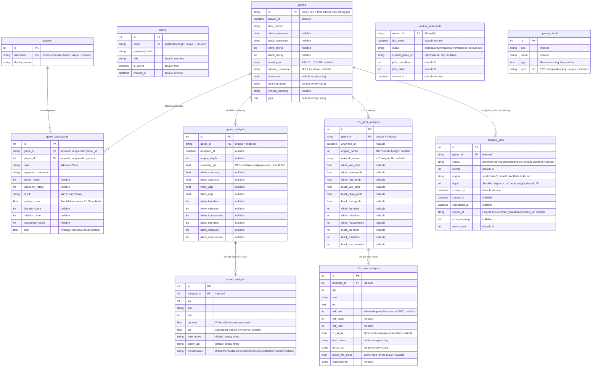
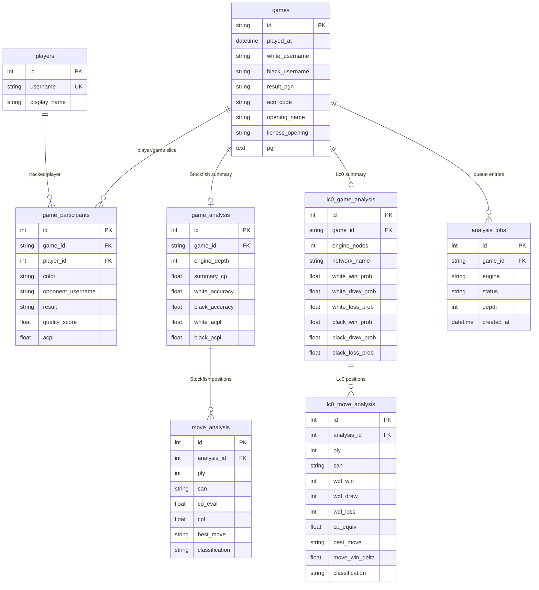
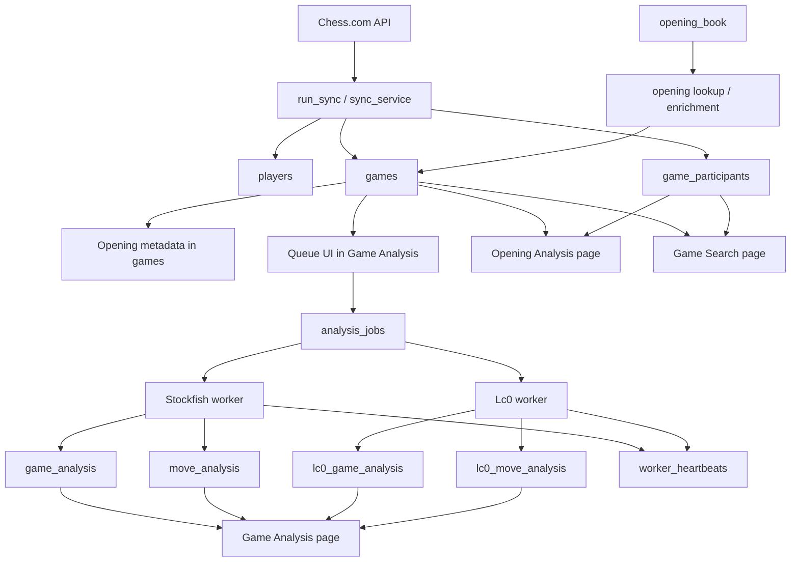

# Database ERD

This document summarizes the current application database schema as defined in:

- `app/storage/models.py`
- `app/storage/database.py`

It includes:

- A full ERD for the current schema
- A simplified ERD focused on the tables the app actively uses most
- A data-flow diagram for ingest, queueing, engine analysis, and UI consumption

## Reading Notes

- `games` is the central table. It is game-centric: it has one row per unique game regardless of how many tracked players participated.
- `game_participants` is the normalized player-centric relationship. Use it for all per-player analytics. Has a unique constraint on `(game_id, player_id)`.
- Stockfish and Lc0 analyses are stored in parallel table families.
- `worker_heartbeats` is related to `analysis_jobs` only logically by `worker_id`; there is no foreign key.
- `users` and `opening_book` are standalone support tables and intentionally do not join into the gameplay graph.

## Full ERD

## Simplified ERD

This view hides support tables and low-traffic columns so the core application model is easier to inspect.

## Table Roles

### Core chess data

- `players`: tracked club/player identities from Chess.com.
- `games`: canonical game record with PGN, opening metadata, usernames, and timestamps. Game-centric — one row per unique game.
- `game_participants`: normalized per-player view of a game. One row per (tracked player × game), enforced by a unique constraint on `(game_id, player_id)`. Best source for all player-centric analytics.

### Stockfish analysis

- `game_analysis`: one Stockfish summary row per game. Includes per-side accuracy, ACPL, and move classification counts.
- `move_analysis`: one row per analyzed ply with centipawn eval, best move, CPL, and classification.

### Lc0 analysis

- `lc0_game_analysis`: one Lc0 WDL summary row per game. Includes per-side win/draw/loss probabilities and move classification counts.
- `lc0_move_analysis`: per-ply WDL permille values (White perspective), Q-derived centipawn equivalent, win-delta, best move, and classification.

### Queue and workers

- `analysis_jobs`: queue and execution history for both Stockfish and Lc0. `engine` column discriminates between them; `depth` is dual-purpose (Stockfish search depth or Lc0 node budget).
- `worker_heartbeats`: live worker status tracking; related to jobs by `worker_id` string, not FK.

### Support tables

- `users`: application authentication and authorization.
- `opening_book`: reference dataset for mapping board EPD strings to named openings. Loaded into a process-level LRU cache for fast lookup.

## Data Flow

## Implementation Notes

- `games` has no foreign key to `players` — it is game-centric with usernames stored as plain strings. The player graph is connected entirely through `game_participants`.
- `game_participants` has a unique constraint on `(game_id, player_id)` named `uq_game_participant`.
- `game_participants.result` is always from the tracked player's perspective ('Win'/'Loss'/'Draw').
- `analysis_jobs.depth` is dual-purpose: Stockfish search depth for Stockfish jobs; MCTS node budget for Lc0 jobs.
- `worker_heartbeats.current_game_id` is informational only; it is not enforced by a foreign key.
- `opening_book` is a reference/lookup table and does not own any downstream records. It is populated once from Lichess TSV data files.
- All WDL values in `lc0_move_analysis` are stored from White's perspective regardless of who moved.
- `lc0_move_analysis` includes `arrow_uci` (best move arrow) matching the Stockfish `move_analysis` schema.
